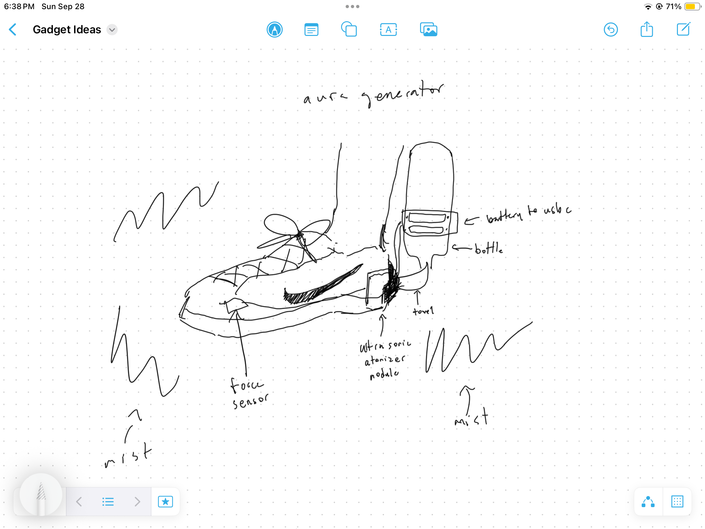

# aura generator !!
- Creates a constant mist effect, similar to stage smoke, for dramatic effect
- Runs on USB-C powered ultrasonic atomizer modules that can be switched on and off
- Water from a bottle strapped to the leg drips slowly into the modules through a towel plug
- Water can be dyed (e.g., purple) with food coloring to create themed effects, like a Halloween vibe

video at https://www.youtube.com/watch?v=ul6SC5NBSu8

writeup at https://www.darsh.app/blog/AuraGenerator

